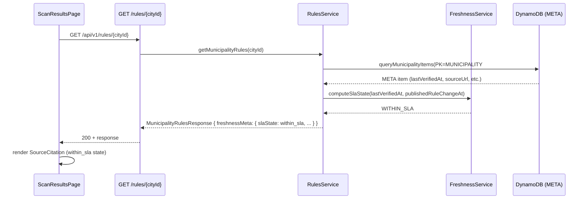
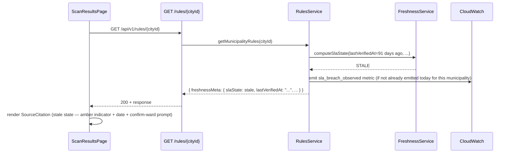
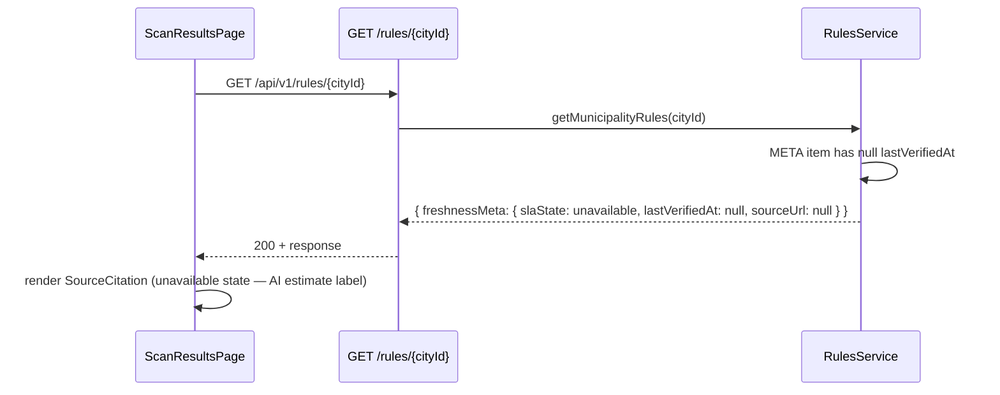
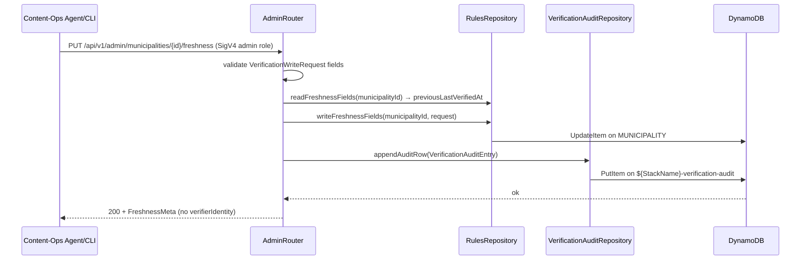

# Design Document — Source-Fidelity & Accuracy-Update SLA (Spec 38)

**Status:** Draft — Data Architect signed off; awaiting Security Architect and Senior Content Writer sign-off  
**Phase:** SDD Phase 3 (Design)  
**Author:** Application Architect  
**Source:** [AIW-56](/AIW/issues/AIW-56), requirements at [`requirements.md`](./requirements.md)

---

## Overview

This spec makes every AI classification answer in Gomi Bunrui **sourced** (city-rule citation) and **dated** (last-verified timestamp), and publishes the re-verification cadence as a binding public SLA. It is delivered in two inseparable slices:

- **Slice A — Citation UI**: `ScanResultPage` displays a `SourceCitation` block on every result, rendering one of three honest states (`within_sla`, `stale`, `unavailable`).
- **Slice B — Freshness Pipeline**: The recycling-rules backend stores and exposes `Freshness_Metadata` per municipality, computes `slaState` at query time, emits breach analytics, and provides a write path for content-ops verification records.

The slices share a single data contract (the extended `MunicipalityRulesResponse`). Neither can ship without the other without creating a dishonest product surface.

Applies to: guest and registered users; EN and JA locales; all `Actively_Covered_Municipality` values served by the recycling-rules API.

---

## Key Design Decisions

| # | Decision | Rationale |
|---|----------|-----------|
| 1 | Inline degradation per result (Option A from open question 1) | Req 4.2 requires disclosure "before the user can act on it"; per-item inline guarantees this regardless of scroll position. One-banner-per-session (Option B) cannot guarantee the user sees it before acting on a specific result. |
| 2 | `slaState` computed server-side at query time, not stored | Avoids stale-state in storage; threshold values are SSM params, changeable without data migration. |
| 3 | Freshness fields co-located with the existing `META` DynamoDB item | Freshness metadata is fetched on every rules lookup; a second table would add a DynamoDB round-trip on the hot path. Audit history goes to a separate append-only table. (Data Architect to confirm — see §Data Models.) |
| 4 | `verifierIdentity` never leaves the server | All API DTOs explicitly exclude the field at construction in `RulesService`. The Kotlin data class `FreshnessMeta` has no `verifierIdentity` property. |
| 5 | SLA thresholds in SSM, not hardcoded | Parameters `/gomi/{stage}/sla-baseline-days` (default 90) and `/gomi/{stage}/sla-change-response-days` (default 14) allow adjustment without code changes or data migrations. |
| 6 | `sla_breach_observed` event deduped per `(municipalityId, day)` via best-effort in-memory check | Prevents metric flooding; Lambda restarts lose state, but a small over-count on cold starts is acceptable for an operational metric (not a billing or compliance signal). |
| 7 | `sourceSnapshotRef` is an opaque string (URL + retrieved-at + hash) | Decouples content-ops tooling from the storage format; Phase 5 content-ops tooling can define the canonical format. |
| 8 | Verification write endpoint is IAM-protected admin route | Req 2 write path is not user-facing; must be restricted to content-ops agent/human caller. Security Architect to review IAM scope. |

---

## Architecture

### System Context

```
Browser (PWA)
  │  SourceCitation component (Slice A)
  │   └─ renders within_sla / stale / unavailable state
  │         └─ outbound link → municipal portal (rel="noopener noreferrer", no query params)
  │
  ▼ HTTPS / SigV4
API Gateway HTTP API
  │  GET /api/v1/rules/{cityId}         (existing, extended)
  │  PUT /api/v1/admin/municipalities/{id}/freshness  (new, admin-IAM-only)
  ▼
ImageScan Lambda (Kotlin / http4k)
  │  RulesRouter  →  RulesService  →  RulesRepository
  │                   FreshnessService  (new)
  │                   VerificationAuditRepository  (new)
  │
  ├── DynamoDB: gomi-bunrui-rules (extended META item)
  └── DynamoDB: ${StackName}-verification-audit (new)

Marketing site (static)
  └─ AccuracySlaPage  (new static page, linked from /about and footer)
```

### Module Decomposition

**Backend (Kotlin / http4k):**

```
backend/image-scan-lambda/src/main/kotlin/com/georgeracu/gomi/bunrui/
├── model/
│   ├── DataModels.kt             ← extend MunicipalityRulesResponse; add FreshnessMeta DTO
│   └── VerificationModels.kt     ← VerificationWriteRequest, VerificationAuditEntry (new)
├── service/
│   ├── RulesService.kt           ← extend: populate FreshnessMeta, call FreshnessService, emit breach event
│   └── FreshnessService.kt       ← slaState computation, breach detection (new)
├── repository/
│   ├── RulesRepository.kt        ← extend: read/write freshness fields on META item
│   └── VerificationAuditRepository.kt  ← append verification audit rows (new)
└── router/
    └── AdminRouter.kt            ← PUT /admin/municipalities/{id}/freshness (new, admin-only)
```

**Frontend (React / TypeScript):**

```
frontend/src/
├── components/
│   └── SourceCitation.tsx        ← new presentational component (three states)
├── pages/
│   ├── ScanResultsPage.tsx       ← integrate SourceCitation per result
│   └── AccuracySlaPage.tsx       ← new public page (in-app /about or dedicated route)
└── i18n/
    ├── en.json                   ← new keys: source.*, sla.*
    └── ja.json                   ← new keys: source.*, sla.*
```

**Website (static):**

```
website/src/
└── pages/
    └── accuracy-sla.html         ← static marketing-site accuracy SLA page (MINOR-008: implemented as .html, not .astro)
```

---

## Components and Interfaces

### FreshnessMeta DTO (Kotlin — user-facing)

```kotlin
data class FreshnessMeta(
    val lastVerifiedAt: String?,      // ISO-8601 or null
    val sourceUrl: String?,           // Municipal portal URL or null
    val sourceLanguage: String?,      // "ja" | "en" | null
    val slaState: SlaState,           // computed, never null
    // verifierIdentity is INTENTIONALLY ABSENT from this class
)

enum class SlaState { WITHIN_SLA, STALE, UNAVAILABLE }
```

### Extended MunicipalityRulesResponse (Kotlin)

Extend the existing `MunicipalityRulesResponse` at `DataModels.kt`:

```kotlin
data class MunicipalityRulesResponse(
    // ... existing fields ...
    val freshnessMeta: FreshnessMeta   // new field
)
```

### FreshnessService (Kotlin — new)

```kotlin
class FreshnessService(
    private val ssmClient: SsmParameterClient = SsmParameterClient.instance
) {
    fun computeSlaState(lastVerifiedAt: Instant?, publishedRuleChangeAt: Instant?): SlaState
    fun isBaselineBreach(lastVerifiedAt: Instant, now: Instant): Boolean
    fun isChangeResponseBreach(lastVerifiedAt: Instant, publishedRuleChangeAt: Instant, now: Instant): Boolean
}
```

- Reads `/gomi/{stage}/sla-baseline-days` (default 90) and `/gomi/{stage}/sla-change-response-days` (default 14) from SSM on first call, cached in Lambda instance.
- `computeSlaState` returns `UNAVAILABLE` when `lastVerifiedAt` is null; `STALE` when baseline or change-response breach; `WITHIN_SLA` otherwise.

### VerificationWriteRequest / VerificationAuditEntry (Kotlin — new)

```kotlin
data class VerificationWriteRequest(
    val lastVerifiedAt: String,       // ISO-8601, required
    val sourceUrl: String,            // required
    val sourceLanguage: String,       // "ja" | "en"
    val verifierIdentity: String,     // opaque content-ops identity
    val sourceSnapshotRef: String? = null,
    val publishedRuleChangeAt: String? = null  // ISO-8601 if known
)

data class VerificationAuditEntry(
    val municipalityId: String,
    val verifiedAt: String,           // ISO-8601
    val verifierIdentity: String,
    val previousLastVerifiedAt: String?,
    val newLastVerifiedAt: String,
    val sourceUrl: String,
    val sourceSnapshotRef: String?
)
```

### SourceCitation React Component (TypeScript — new)

```typescript
interface SourceCitationProps {
  slaState: 'within_sla' | 'stale' | 'unavailable';
  sourceUrl?: string;
  sourceLanguage?: 'ja' | 'en';
  lastVerifiedAt?: string;   // ISO-8601
  locale: 'en' | 'ja';
}
```

Renders:
- `within_sla`: source label, tappable link (with `rel="noopener noreferrer"`), `lastVerifiedAt` formatted in user locale, JA-only disclosure when `sourceLanguage === 'ja' && locale === 'en'`
- `stale`: muted amber variant; source label, link, actual `lastVerifiedAt` date, prompt to confirm with ward (copy placeholder — see §Copy Intent)
- `unavailable`: "AI estimate — no municipal source mapped" label (copy placeholder — see §Copy Intent)

Accessibility requirements:
- `aria-live="polite"` region for state changes
- WCAG 2.1 AA contrast on all three states
- Screen-reader reading order: source label → freshness state → link disclosure
- JA layout must not truncate freshness state or shrink tap targets

### AdminRouter (Kotlin — new)

```
PUT /api/v1/admin/municipalities/{municipalityId}/freshness
Auth: AWS IAM (admin role — see §Security Architecture)
Content-Type: application/json
Body: VerificationWriteRequest
Response: 200 OK with updated FreshnessMeta
```

Responsibilities:
- Validates `lastVerifiedAt`, `sourceUrl`, `sourceLanguage`, `verifierIdentity` non-blank
- Reads existing `lastVerifiedAt` from META item (for audit row previous value)
- Calls `RulesRepository.writeFreshnessFields(municipalityId, request)`
- Calls `VerificationAuditRepository.appendAuditRow(auditEntry)`
- Returns updated `FreshnessMeta` (without `verifierIdentity`)

---

## API Specifications

### Extended `GET /api/v1/rules/{cityId}` Response

Adds `freshnessMeta` to the existing `MunicipalityRulesResponse` JSON. Backwards-compatible (new field, not a breaking change).

```json
{
  "municipalityId": "nagoya",
  "name": { "en": "Nagoya", "ja": "名古屋市" },
  "freshnessMeta": {
    "lastVerifiedAt": "2026-04-10T09:00:00Z",
    "sourceUrl": "https://www.city.nagoya.jp/kankyo/category/29-3-6-0-0-0-0-0-0-0.html",
    "sourceLanguage": "ja",
    "slaState": "within_sla"
  }
}
```

When `lastVerifiedAt` is null or missing from storage, the response returns:

```json
{
  "freshnessMeta": {
    "lastVerifiedAt": null,
    "sourceUrl": null,
    "sourceLanguage": null,
    "slaState": "unavailable"
  }
}
```

### New `PUT /api/v1/admin/municipalities/{municipalityId}/freshness`

```json
// Request
{
  "lastVerifiedAt": "2026-05-13T12:00:00Z",
  "sourceUrl": "https://www.city.nagoya.jp/...",
  "sourceLanguage": "ja",
  "verifierIdentity": "content-ops-agent-001",
  "sourceSnapshotRef": "https://snapshots.internal/nagoya-2026-05-13.pdf",
  "publishedRuleChangeAt": null
}

// Response 200
{
  "lastVerifiedAt": "2026-05-13T12:00:00Z",
  "sourceUrl": "https://www.city.nagoya.jp/...",
  "sourceLanguage": "ja",
  "slaState": "within_sla"
}
```

| Status | Condition |
|--------|-----------|
| `200 OK` | Verification recorded and freshness updated |
| `400 Bad Request` | Blank required fields, invalid ISO-8601 date |
| `403 Forbidden` | Missing admin IAM role |
| `404 Not Found` | `municipalityId` not in `gomi-bunrui-rules` table |
| `500 Internal Server Error` | DynamoDB write failure |

### Extended scan-feedback event (Req 5 — `POST /api/v1/scan-feedback`)

Extend the existing `ScanFeedbackRequest` DTO (spec 37 / [AIW-37](/AIW/issues/AIW-37)):

```kotlin
data class ScanFeedbackRequest(
    val scanId: String,
    val municipalityId: String,
    val userReportedCorrect: Boolean,
    val correctedCategory: String? = null,
    val slaState: String? = null      // "within_sla" | "stale" | "unavailable" — new
)
```

`slaState` is client-supplied (the frontend passes the value it rendered at decision time). Server-side validation: must be one of the three valid values or null; invalid values are rejected with `400`.

---

## Sequence Diagrams

### Happy Path — Fresh Citation



### Stale Citation — Breach Observed



### Source Unavailable



### Verification Write (Content-Ops)



---

## Data Models

> **Note:** Detailed data model sign-off is provided in §Data Architecture (Data Architect section below). The Application Architect's recommendation is recorded here for review.

### Recommendation: Co-locate Freshness Fields on Existing `META` Item

The existing `gomi-bunrui-rules` table schema uses `PK=MUNICIPALITY#{id}`, `SK=META` for municipality metadata. **Recommendation: add freshness fields directly to this item** to avoid a second DynamoDB read on the hot path.

**New fields added to `META` item:**

| Attribute | Type | Notes |
|-----------|------|-------|
| `lastVerifiedAt` | S | ISO-8601 UTC; null until first verification |
| `sourceUrl` | S | May equal `officialGuidelineUrl` or be overridden |
| `sourceLanguage` | S | `"ja"` or `"en"` |
| `sourceSnapshotRef` | S | Optional opaque reference to captured source content |
| `verifierIdentity` | S | Opaque identity string; **never projected to API response** |
| `publishedRuleChangeAt` | S | ISO-8601 UTC of last known published municipal rule change; drives 14-day SLA clock |

### New Table: `${StackName}-verification-audit`

Append-only audit log per Req 2.3. Data Architect to confirm partitioning strategy.

**Proposed schema:**

| Attribute | Type | Role | Notes |
|-----------|------|------|-------|
| `municipalityId` | S | PK | |
| `sk` | S | SK | `VERIFICATION#{ISO-8601}#{uuidv4}` |
| `verifiedAt` | S | — | ISO-8601 UTC |
| `verifierIdentity` | S | — | Never in API response |
| `previousLastVerifiedAt` | S | — | Before value; null if first verification |
| `newLastVerifiedAt` | S | — | After value |
| `sourceUrl` | S | — | |
| `sourceLanguage` | S | — | |
| `sourceSnapshotRef` | S | — | Optional |

**Billing mode:** On-demand (PAY_PER_REQUEST)  
**PITR:** Enabled  
**Encryption at rest:** AWS-managed KMS  
**TTL:** None — permanent audit record

### Scan-Feedback Table Extension

Add `slaState` attribute (String, nullable) to existing `gomi-scan-feedback-{stage}` items. No schema migration required (DynamoDB is schemaless); new items carry the field, existing items lack it (treated as null in analytics queries).

---

## §Data Architecture

**Signed off by:** Data Architect
**Date:** 2026-05-13
**Issue:** [AIW-58](/AIW/issues/AIW-58)

---

### 1. Freshness_Metadata Placement — CONFIRMED: Co-locate on existing META item

**Decision:** Confirmed. Freshness fields are added directly to the existing `META` item (`PK=MUNICIPALITY#{id}`, `SK=META`) in `gomi-bunrui-rules`. No separate table or materialised-view pattern is warranted.

**Rationale:**

- **Hot-path read efficiency**: The META item is already fetched on every `GET /rules/{cityId}` call. Co-locating freshness fields adds zero additional DynamoDB I/O on the read path — the binding constraint for a user-facing API.
- **Item size safety**: The six new string attributes (`lastVerifiedAt`, `sourceUrl`, `sourceLanguage`, `sourceSnapshotRef`, `verifierIdentity`, `publishedRuleChangeAt`) add at most ~600 bytes to the META item. DynamoDB's 400 KB item limit is not approached.
- **Write-path isolation**: Freshness writes are content-ops operations at most ~daily per municipality — not on the user-facing read path. No hot-key, write-contention, or partition-heat concern arises from co-location at this cadence.
- **Alternative rejected**: A separate `freshness` table would require a second DynamoDB `GetItem` / `Query` on every rules response, adding one full round-trip to the hot path. This violates the latency invariant in §Performance Considerations. A materialised-view pattern would introduce dual-write consistency complexity with no benefit at current scale.

Re-evaluate if freshness data needs multi-version history beyond what `${StackName}-verification-audit` provides, or if item size approaches 100 KB (neither is likely within the foreseeable municipality coverage plan).

---

### 2. `${StackName}-verification-audit` Table — CONFIRMED

**Decision:** Schema confirmed as proposed. `municipalityId` as PK is appropriate. No GSI is needed. No TTL — permanent audit record.

**Partition key analysis:**

At most ~100 municipalities × ~1 write/day = ~100 writes/day across the entire table. Each partition receives at most one write per day. This is negligible by any DynamoDB partitioning metric. With on-demand billing mode there is no pre-provisioned capacity to exhaust, and DynamoDB's adaptive capacity handles any transient skew automatically.

**Sort key design:**

`VERIFICATION#{ISO-8601 UTC}#{uuidv4}` provides:

- **Chronological ordering** within a partition: ISO-8601 UTC strings sort lexicographically when zero-padded, so `Query` with ascending order yields a time-ordered audit trail per municipality.
- **Collision safety**: The appended UUID guarantees uniqueness even if two verifications occur within the same millisecond.
- **Efficient range queries**: `SK BEGINS_WITH "VERIFICATION#2026"` retrieves all 2026 verifications for a municipality without a scan.

**GSI — not needed:**

The sole anticipated query pattern is "all verifications for municipality X" — satisfied by a direct PK lookup. No cross-municipality query (e.g. "most-recently-verified municipality globally") is a stated requirement for Phase 4. At 100 municipalities, a full table scan for ad-hoc cross-municipality queries is also acceptable for infrequent content-ops use.

**TTL — none (permanent):**

Audit records must be retained indefinitely for accountability and retrospective SLA compliance review. Omitting TTL is correct. PITR enabled for point-in-time recovery.

**Confirmed table configuration:**

| Parameter | Value |
|-----------|-------|
| Billing mode | PAY_PER_REQUEST (on-demand) |
| PITR | Enabled |
| Encryption at rest | AWS-managed KMS |
| TTL | None — permanent audit |
| GSI | None |

---

### 3. Scan-Feedback `slaState` Extension — CONFIRMED: No schema impact

**Decision:** Confirmed. Adding `slaState` (nullable String) to `gomi-scan-feedback-{stage}` items has no schema impact and requires no index changes.

**Rationale:**

DynamoDB is schemaless. New feedback items written after this spec ships will carry `slaState`; existing items will not. Analytics consumers must handle both cases (field absent → treat as null). This graceful dual-state is already documented in §Data Models and requires no migration script.

**Index impact:** The existing access patterns on `gomi-scan-feedback-{stage}` — queries by `municipalityId`, `scanId`, or time range via any existing GSI structure — are unaffected. `slaState` is not a query dimension in scope for this spec. If feedback segmentation by `slaState` becomes a query requirement in a future spec (e.g. "all stale-state feedback for municipality X"), a GSI on `(slaState, municipalityId)` should be evaluated at that time.

---

### 4. Operational Query Pattern for Stale Municipalities — No GSI Required at Phase 4 Scale

**Decision:** No GSI on `gomi-bunrui-rules` is required for Phase 4. A full-table scan filtered to `SK=META` items followed by application-layer `slaState` computation is sufficient for content-ops tooling at ~100 municipalities.

**Analysis:**

| Approach | I/O cost at 100 municipalities | Complexity | Recommendation |
|----------|-------------------------------|------------|----------------|
| Scan `gomi-bunrui-rules`, filter `SK=META`, compute `slaState` in-process | ~100 reads; <50 ms | Nil — single scan, SSM threshold applied in-process | **Phase 4: use this** |
| Sparse GSI on `lastVerifiedAt` | GSI maintained on every META write; range query by date threshold | Cannot index computed `slaState` directly; threshold must be applied at query time | Defer to Phase 5 if scale warrants |
| Separate staleness-tracking table | One additional write on every verification | Dual-write consistency risk; operational overhead | Not recommended |

**Key constraint:** `slaState` is computed at read time from `lastVerifiedAt`, `publishedRuleChangeAt`, and SSM threshold parameters (Decision #2 in §Key Design Decisions). Storing a pre-computed `slaState` in DynamoDB would reintroduce stale-state risk and require rewriting all affected items whenever SSM thresholds change — explicitly avoided by the design.

**Scaling note:** If municipality coverage grows beyond ~500 or content-ops dashboards become high-frequency query targets, add a sparse GSI to `gomi-bunrui-rules`:

```
GSI name:   lastVerifiedAt-index
PK:         itemType (discriminator attribute "META" added to all META items)
SK:         lastVerifiedAt
Projection: KEYS_ONLY + lastVerifiedAt, publishedRuleChangeAt
```

This allows efficient range queries like "all META items with `lastVerifiedAt` older than N days" without a full scan. Evaluate as a Phase 5 enhancement — not a Phase 4 blocker.

---

### Summary

| Item | Decision |
|------|----------|
| Freshness fields on existing META item | Confirmed — zero additional I/O on hot path; item size safe |
| `${StackName}-verification-audit` schema | Confirmed — PK/SK design appropriate for write volume; no GSI; no TTL; on-demand billing |
| Scan-feedback `slaState` extension | Confirmed — schemaless, no index changes, graceful for existing items |
| GSI for stale-municipality operational queries | Not needed for Phase 4 — full scan + application-layer compute sufficient at ~100 municipalities; defer GSI to Phase 5 |

**Data Architecture sign-off complete. Phase 4 data layer is cleared to proceed.**

---

## §Security Architecture

_Signed off by Security Architect — [AIW-59](/AIW/issues/AIW-59). Reviewed 2026-05-13._

### 1. Outbound-Link Hygiene (Req 7)

**Verdict: `rel="noopener noreferrer"` + no-PII-in-URL is sufficient for v1. No CSP `connect-src` or `frame-ancestors` directive change is required for municipal portal outbound links.**

`rel="noopener"` prevents the opened municipal portal page from accessing `window.opener` on the PWA context, eliminating opener hijacking. `rel="noreferrer"` suppresses the `Referer` header on navigation, ensuring no URL fragment or scan context leaks to the portal. Municipal portal links open in a new tab via a plain `<a>` anchor; they are not embedded in `<iframe>` or `<object>`, so `frame-ancestors` is not implicated. `connect-src` governs `fetch()`, `XMLHttpRequest`, and WebSocket — not `<a href>` navigation — so it has no effect here.

**Required: `sourceUrl` query-parameter deny-list at write time.** `AdminRouter` must reject `PUT` requests where `sourceUrl` contains query parameters whose keys match the set `{userId, scanId, sessionId, identityId, token, auth, jwt, sig}`. A URL-parse + key-check on write is sufficient. This prevents content-ops tooling from accidentally writing user-identifying parameters into `sourceUrl` that would then be rendered as a link in the `SourceCitation` component.

**CSP posture:** No CSP headers currently exist in this project (tracked as a future enhancement in `frontend/SECURITY.md`). When a CSP is introduced, the baseline `default-src 'self'` and `connect-src 'self' https://api.gomi-bunrui.app` will be sufficient. Municipal portal URLs are navigation targets (`<a href>`), not fetch targets; no allowlisting under `connect-src` is required. CSP introduction is out of scope for this spec.

---

### 2. Verifier Identity Handling (Req 2.4, 7.3)

**Verdict: The proposed isolation control is correct and necessary. `verifierIdentity` must be treated as potentially PII. Additional access controls on the audit table are required.**

**Control assessment:**

The `FreshnessMeta` Kotlin data class intentionally omits `verifierIdentity`. This is a correct defence-in-depth control: the field is absent at the type level, making accidental API projection a compile-time error rather than a run-time risk. `RulesService.buildFreshnessMeta()` reads the raw DynamoDB `AttributeValue` map and constructs `FreshnessMeta` without a `verifierIdentity` parameter — the value is discarded without ever being bound to a named variable in the user-facing code path. This satisfies Req 7.3.

Log discipline (§Observability) already prohibits `verifierIdentity` from log lines. This must be enforced via code review on every `AdminRouter` and `VerificationAuditRepository` log statement.

**PII assessment:**

`verifierIdentity` is an opaque content-ops string whose likely values include human email addresses (e.g., `ops@gomi-bunrui.app`), agent IDs (e.g., `content-ops-agent-001`), or human display names. Email addresses are PII under GDPR and APPI. The field must be treated as PII by default at both the `gomi-bunrui-rules` META item and the `${StackName}-verification-audit` table.

**Required additional controls:**

| Control | Implementation |
|---------|----------------|
| Encryption at rest — audit table | `${StackName}-verification-audit` uses AWS-managed KMS (already specified in §Data Architecture). For `prod`, upgrade to a CMK to enable independent key-usage audit and annual rotation. |
| Restricted DynamoDB IAM for audit table | Scope the `ImageScanLambdaExecutionRole` policy for `${StackName}-verification-audit` to `dynamodb:PutItem` only (append-only). Remove `GetItem`, `Query`, and `Scan` on this table from the Lambda role — audit reads are for human reviewers only via DynamoDB Console under a separate audit-reader IAM role. |
| Audit reads | Compliance review of `verifierIdentity` values requires direct DynamoDB Console access by an authorised IAM identity. Lambda must not expose a query API over the audit table. |
| APPI right-of-erasure | `verifierIdentity` values that are human email addresses are subject to APPI right-of-deletion. The audit table has no TTL (permanent record by design). When a human operator requests erasure, the relevant audit rows must be purged via a one-off admin script. Document this procedure in the production operational runbook before the first `prod` write. |

---

### 3. Admin Write Endpoint IAM Scope

**Verdict: The admin endpoint must be restricted to a dedicated `gomi-content-ops-${StackName}` IAM role. Both `CognitoAuthenticatedRole` and `CognitoUnauthenticatedRole` must be explicitly denied at the IAM layer.**

**Threat model:** The admin write endpoint sets `lastVerifiedAt` and `sourceUrl` — values users see in the citation UI. Current Cognito roles grant `execute-api:Invoke /*` (wildcard), which would include any new admin route unless explicitly constrained. A compromised or over-privileged Cognito identity reaching this route could forge freshness records.

**Dedicated content-ops role:**

Create IAM role `gomi-content-ops-${StackName}` with managed policy `GomiContentOpsPolicy`:

```json
{
  "Version": "2012-10-17",
  "Statement": [
    {
      "Sid": "AllowAdminFreshnessWrite",
      "Effect": "Allow",
      "Action": "execute-api:Invoke",
      "Resource": "arn:aws:execute-api:{Region}:{AccountId}:{HttpApiId}/{stage}/PUT/api/v1/admin/municipalities/*/freshness"
    }
  ]
}
```

Content-ops agents and CLI tools obtain short-lived credentials via `sts:AssumeRole` on this role (session duration ≤ 1 hour). No long-lived access keys are issued. The role has no other `execute-api:Invoke` permissions.

**Explicit deny on Cognito roles:**

Add the following statement to both `CognitoAuthenticatedRole` and `CognitoUnauthenticatedRole` inline policies in `backend/infrastructure/template.yaml`:

```json
{
  "Sid": "DenyAdminRoutes",
  "Effect": "Deny",
  "Action": "execute-api:Invoke",
  "Resource": "arn:aws:execute-api:{Region}:{AccountId}:{HttpApiId}/*/PUT/api/v1/admin/*"
}
```

An `Effect: Deny` always overrides `Effect: Allow` in AWS IAM, so this prevents any Cognito-issued identity from reaching the admin route even if the wildcard grant is not narrowed in future.

**API Gateway route registration:**

Register `PUT /api/v1/admin/municipalities/{municipalityId}/freshness` with `Auth: AWS_IAM` in `backend/infrastructure/template.yaml`. API Gateway will reject unsigned requests before they reach the Lambda.

**Lambda-level principal check (belt-and-suspenders):**

`AdminRouter` must verify that the calling principal ARN from the IAM authorizer context (`requestContext.authorizer.iam.userArn`) begins with `arn:aws:sts::{AccountId}:assumed-role/gomi-content-ops-`. Return `403 Forbidden` if not. This guards against future IAM policy drift that might accidentally grant the admin route to another role.

---

### 4. `sourceSnapshotRef` Storage

**v1 verdict: No additional controls required.** `sourceSnapshotRef` is an opaque string stored only in DynamoDB (covered by table-level KMS encryption). It is included in the admin write response but absent from the user-facing `GET /rules/{cityId}` response (`FreshnessMeta` has no `sourceSnapshotRef` field). No object storage is introduced in this spec.

**Future S3 posture (Phase 5 content-ops tooling):**

When snapshot content moves to S3, the following controls apply. Phase 5 requires a separate security sign-off before implementation.

| Property | Requirement |
|----------|-------------|
| Bucket | `gomi-source-snapshots-{stage}` — all Block Public Access settings enabled; ACL bucket-owner-enforced |
| Encryption | SSE-S3 minimum; SSE-KMS with CMK for `prod` |
| Bucket policy | Deny all principals not matching `ImageScanLambdaExecutionRole` or `gomi-content-ops-${StackName}` |
| Object versioning | Enabled; transition to Glacier after 90 days; no expiry (permanent audit) |
| `sourceSnapshotRef` value format | `s3://{bucket}/{key}` or a pre-signed URL with max 7-day TTL; never a public URL |
| Lambda access | `s3:GetObject` on `gomi-source-snapshots-{stage}/*` only |
| Content-ops access | `s3:PutObject` on `gomi-source-snapshots-{stage}/snapshots/*` only |

**Security Architecture sign-off complete. Phase 4 security posture is cleared to proceed.**

---

## §Copy Intent

**Status:** Signed off — Senior Content Writer ([AIW-60](/AIW/issues/AIW-60))  
**Lenses applied:** Plain Language, Bilingual Parity, Information Scent, Cultural Specificity, Inclusion, Microcopy Fundamentals, Ethics

---

### `source.citation.label`

**Surface:** `SourceCitation` (within_sla) — prefix label before the tappable source link  
**Formatting notes:** Short prefix; immediately precedes the link. Max ~25 chars EN, ~12 chars JA to fit mobile inline layout without wrapping.

| Locale | Copy |
|--------|------|
| EN | `Municipal source:` |
| JA | `自治体の公式情報：` |

---

### `source.citation.languageDisclosure.jaOnly`

**Surface:** `SourceCitation` — appended after the link label when `sourceLanguage === 'ja'` and `locale === 'en'`  
**Req 1.3 / 6.2:** Must not imply an English-language page exists. Copy is honest that the linked page is in Japanese only.  
**Formatting notes:** Parenthetical, rendered immediately after the link. JA value exists in the JA i18n file for catalogue completeness but is never rendered (this disclosure is suppressed on JA locale by component logic).

| Locale | Copy |
|--------|------|
| EN | `(Japanese only)` |
| JA | `（日本語のみ）` |

---

### `source.citation.lastVerified`

**Surface:** `SourceCitation` (within_sla and stale) — freshness date line  
**Formatting notes:** `{{date}}` is a locale-formatted date string injected by the component (e.g., "April 10, 2026" in EN; "2026年4月10日" in JA). Do not localise the placeholder itself.

| Locale | Copy |
|--------|------|
| EN | `Last verified: {{date}}` |
| JA | `最終確認日：{{date}}` |

---

### `source.stale.label`

**Surface:** `SourceCitation` (stale state) — amber indicator label  
**Req 4.5 / 6.3:** Senior Content Writer sign-off explicitly required for this key.  
**Formatting notes:** Replaces `source.citation.label` in the stale variant. `{{date}}` is the actual `lastVerifiedAt` date, locale-formatted. Informative but not alarming — this is a disclosure, not an error. Amber visual treatment is handled by component styling, not copy.

| Locale | Copy |
|--------|------|
| EN | `Source not recently verified (last checked: {{date}})` |
| JA | `情報が古い可能性があります（最終確認：{{date}}）` |

---

### `source.stale.confirmationPrompt`

**Surface:** `SourceCitation` (stale state) — secondary prompt below the label  
**Req 4.5 / 6.3:** Senior Content Writer sign-off explicitly required for this key.  
**Formatting notes:** Imperative, action-oriented. Names both ward and city offices because covered municipalities include both ward-based and non-ward city structures. Renders comfortably in 2 lines at 375 px.

| Locale | Copy |
|--------|------|
| EN | `Rules may have changed. Confirm with your local ward or city office before disposing.` |
| JA | `ルールが変更されている可能性があります。廃棄前にお住まいの区役所・市役所にご確認ください。` |

---

### `source.unavailable.label`

**Surface:** `SourceCitation` (unavailable state) — single label, no link  
**Formatting notes:** "AI estimate" is front-loaded so the user immediately understands the nature of the answer. Honest about the absence of a verified source — does not imply a source exists but is temporarily unavailable.

| Locale | Copy |
|--------|------|
| EN | `AI estimate — no verified source for your municipality yet` |
| JA | `AI推定 — お住まいの自治体の情報はまだ確認されていません` |

---

### `sla.page.title`

**Surface:** `AccuracySlaPage` — page `<h1>` heading  
**Req 3.4 / 3.5:** EN and JA must ship together.  
**Formatting notes:** Friendly, non-legalistic. "Commitment" implies accountability without sounding like a legal terms page.

| Locale | Copy |
|--------|------|
| EN | `Our accuracy commitment` |
| JA | `精度に関する取り組み` |

---

### `sla.page.commitment`

**Surface:** `AccuracySlaPage` — main body paragraph stating the SLA  
**Req 3.4 / 3.5:** EN and JA must ship together.  
**Formatting notes:** Plain language. Both 14-day and 90-day thresholds named explicitly. "We aim to" (not "we guarantee") is intentionally honest in both locales — matches the SLA posture in requirements. Two sentences.

| Locale | Copy |
|--------|------|
| EN | `We verify disposal rules from official municipal sources. We aim to update any rule within 14 days of a published municipal change, and to re-verify all rules at least every 90 days.` |
| JA | `ゴミ分別ルールは各自治体の公式情報をもとに確認しています。自治体によるルール変更の公表から14日以内に更新し、すべてのルールを90日ごとに再確認することを目指しています。` |

---

### `sla.page.breachPosture`

**Surface:** `AccuracySlaPage` — paragraph describing in-product behaviour when SLA is missed  
**Req 3.4 / 3.5:** EN and JA must ship together.  
**Formatting notes:** "not recently verified" echoes `source.stale.label` copy for terminology consistency. Frames the breach as transparency enabling user agency — not a failure disclosure.

| Locale | Copy |
|--------|------|
| EN | `When a source has not been re-verified within our target period, the result is labelled "not recently verified." You can then decide whether to confirm the rules with your local ward or city office before disposing.` |
| JA | `確認の目標期間を超えた情報には「最近確認されていません」と表示します。廃棄前にお住まいの区役所・市役所でルールをご確認されることをお勧めします。` |

---

### `sla.page.activelyCoveredMunicipalities`

**Surface:** `AccuracySlaPage` — intro sentence above the municipalities list  
**Req 3.4 / 3.5:** EN and JA must ship together.  
**Formatting notes:** Fixed label before a dynamic list managed by content-ops. "Verified disposal rules" distinguishes the actively-maintained set from AI-only coverage.

| Locale | Copy |
|--------|------|
| EN | `The following municipalities currently have verified disposal rules in Gomi Bunrui:` |
| JA | `現在、ゴミ分類アプリで確認済みのごみ分別ルールがある自治体：` |

---

### `onboarding.sourceFidelityIntro`

**Surface:** Onboarding step — brief copy introducing the citation commitment  
**Formatting notes:** Two short sentences. Fits on a single onboarding card at 375 px without scrolling. "When they were last checked" is plain-language for `lastVerifiedAt`.

| Locale | Copy |
|--------|------|
| EN | `Every answer comes with a source. We cite official municipal guidelines and tell you when they were last checked.` |
| JA | `すべての回答には出典が付いています。各自治体の公式ガイドラインをもとに、最終確認日とあわせてお伝えします。` |

---

### Interpolation reference

| Placeholder | Used in keys | Injected value |
|-------------|-------------|----------------|
| `{{date}}` | `source.citation.lastVerified`, `source.stale.label` | Locale-formatted date from `lastVerifiedAt` (e.g., "April 10, 2026" / "2026年4月10日") |

### Voice/tone guide additions

The following new terminology is introduced by these strings and must be reflected in the voice/tone guide before Phase 8:

| Term (EN) | Term (JA) | Guidance |
|-----------|-----------|----------|
| Municipal source | 自治体の公式情報 | Use for the citation label. Not "official source" or "city data." |
| Not recently verified | 最近確認されていません | Consistent across `source.stale.label`, `sla.page.breachPosture`, and any stale-state UI. Do not say "outdated" or "expired." |
| AI estimate | AI推定 | Exact phrasing for the unavailable state. Do not say "AI-generated" or "not verified." |
| Ward or city office | 区役所・市役所 | Always name both — covered set includes ward-based (e.g. Tokyo 23 wards) and non-ward city structures. |

---

## Error Handling

| Layer | Error | Response |
|-------|-------|----------|
| `RulesService` | DynamoDB read on freshness fields throws | Log + metric; serve `slaState: unavailable` as safe fallback; **scan result is not blocked** |
| `RulesService` | `lastVerifiedAt` absent from META item | Treated as null; `slaState: unavailable` |
| `FreshnessService` | SSM parameter read fails | Use compiled-in defaults (90 / 14 days); log warning |
| `AdminRouter` | Blank required fields | `400 VALIDATION_ERROR` with field list |
| `AdminRouter` | Invalid ISO-8601 date | `400 INVALID_DATE` |
| `AdminRouter` | `municipalityId` not found | `404 NOT_FOUND` |
| `AdminRouter` | DynamoDB write fails | `500 INTERNAL_ERROR`; audit row not written if META update fails |
| `VerificationAuditRepository` | DynamoDB write fails | Log error + metric; META update is already committed; audit row loss is recoverable from CloudWatch logs |
| Frontend `SourceCitation` | `freshnessMeta` absent from API response | Render `unavailable` state (defensive default) |
| Frontend `SourceCitation` | `slaState` value not one of known enum values | Render `unavailable` state |
| Frontend scan-feedback | `slaState` rejected with `400` on feedback submission | Log client error; feedback submission fails gracefully (does not block user) |

**Invariant:** Freshness metadata errors must never propagate as a 5xx to the user-facing rules endpoint. The rules response is always served; `slaState` degrades to `unavailable` on any freshness read failure.

---

## Observability

### Logs

`RulesService` — structured INFO on every rules fetch with freshness data:

```
Serving municipality rules [municipalityId: ..., slaState: ..., daysSinceVerification: ..., stage: ...]
```

`RulesService` — structured WARN when freshness fields are absent:

```
Freshness metadata absent for municipality [municipalityId: ..., stage: ...]
```

`RulesService` — structured WARN on breach observation:

```
SLA breach observed [municipalityId: ..., lastVerifiedAt: ..., daysSinceVerification: ..., slaState: stale]
```

`AdminRouter` — INFO on successful verification write:

```
Verification recorded [municipalityId: ..., verifiedAt: ..., slaState: within_sla]
```

No `verifierIdentity`, `sourceSnapshotRef`, or PII in any log line.

### Metrics

| Metric | Namespace | Dimensions | Description |
|--------|-----------|------------|-------------|
| `SlaBreachObserved` | `Gomi/Rules` | `MunicipalityId`, `Stage` | Count; emitted once per `(municipalityId, day)` best-effort |
| `FreshnessUnavailableServed` | `Gomi/Rules` | `Stage` | Count; emitted when `slaState = unavailable` is returned |
| `VerificationWritten` | `Gomi/Rules` | `MunicipalityId`, `Stage` | Count; emitted on successful content-ops write |

**Alarm:** `SlaBreachAlarm` — `SlaBreachObserved ≥ 1` for any municipality within a 24-hour window. Action: SNS `AlarmNotificationTopic`.

### Analytics Events

`sla_breach_observed` — emitted to the analytics pipeline when `slaState = stale` is served. Schema:

```json
{
  "event": "sla_breach_observed",
  "municipalityId": "nagoya",
  "lastVerifiedAt": "2026-02-10T09:00:00Z",
  "daysSinceVerification": 92,
  "stage": "prod"
}
```

Deduplication: best-effort per Lambda instance per `(municipalityId, calendar day UTC)`. Over-counting on cold starts is acceptable.

`scan_feedback_submitted` event extended with `slaState` field per Req 5.1 (from spec 37 event schema).

---

## Testing Strategy

### Backend Unit Tests (Kotlin)

| File | Coverage |
|------|---------|
| `FreshnessServiceTest.kt` | `within_sla` when `lastVerifiedAt` = 89 days ago; `stale` when = 91 days ago (baseline); `stale` when `publishedRuleChangeAt` = 13 days ago and `lastVerifiedAt` = 15 days ago (change-response breach); `within_sla` when `publishedRuleChangeAt` = 13 days ago but `lastVerifiedAt` = same day as change; `unavailable` when `lastVerifiedAt` null; SSM default fallback when SSM unreachable |
| `RulesServiceTest.kt` (extended) | `slaState` present in response; `verifierIdentity` absent from response; freshness read error → `slaState: unavailable` (no 500); `sla_breach_observed` metric emitted on stale; breach metric NOT re-emitted on second call within same day. **MINOR-009 — Coverage debt:** RS-1–5 freshness path tests (slaState propagation, verifierIdentity absence, stale metric) were not added to `RulesServiceTest.kt` in Phase 4. 0% unit coverage on `RulesService` freshness delegation. Follow-up Kotest tests recommended (mock `FreshnessService` and `RulesRepository`). See spec-maintenance-report.md. |
| `AdminRouterTest.kt` | `200` on valid write; `400` on blank `lastVerifiedAt`; `400` on invalid ISO-8601; `403` on missing admin role; `404` on unknown municipalityId; `500` on DynamoDB failure; audit row written on success |

### Frontend Unit Tests (Vitest / React Testing Library)

| File | Coverage |
|------|---------|
| `SourceCitation.test.tsx` | Renders all three states; `rel="noopener noreferrer"` present on link; no query params on link; JA-only disclosure present when `sourceLanguage=ja && locale=en`; JA-only disclosure absent when `locale=ja`; `aria-live` region present; WCAG axe scan zero violations (EN and JA render) |

### E2E Tests (Playwright)

| File | Scenarios |
|------|-----------|
| `e2e/tests/flows/source-citation.spec.ts` | Scan result shows fresh citation with link and date; scan result shows stale state with amber indicator; scan result shows unavailable state ("AI estimate" label); clicking citation link opens new tab (noopener); citation link has no user-identifying query params; JA locale shows JA-only disclosure on EN UI |
| `e2e/tests/flows/accuracy-sla-page.spec.ts` | `/about/accuracy-sla` route renders in EN; same route renders in JA; link from `/about` footer present; marketing-site footer link present |

### Accessibility Regression

Run axe on `ScanResultPage` at 375 px viewport in all three `slaState` variants (within_sla, stale, unavailable) × two locales (EN, JA). Zero violations expected. JA layout check: source label + date do not truncate under 40-character municipality names.

---

## Correctness Properties

1. **verifierIdentity isolation** — `FreshnessMeta` Kotlin data class has no `verifierIdentity` property. `RulesService.buildFreshnessMeta()` reads the field from the raw DynamoDB `AttributeValue` map and immediately discards it; the value is never assigned to any in-scope variable in the user-facing code path.

2. **slaState server authority** — `slaState` is computed inside `FreshnessService.computeSlaState()` from server-side timestamps and SSM thresholds. No client-supplied value influences the `slaState` in the `GET /rules/{cityId}` response.

3. **Non-blocking freshness failure** — `RulesService.getMunicipalityRules()` wraps the freshness field read in a try/catch. Any exception produces `slaState = UNAVAILABLE` without re-throwing. This invariant must be validated by `RulesServiceTest.kt`.

4. **Outbound-link hygiene** — `SourceCitation.tsx` constructs the anchor element with a static `rel="noopener noreferrer"` attribute and does not append any query parameters to `sourceUrl`. This must be validated by `SourceCitation.test.tsx` with a URL regex assertion.

5. **Audit trail completeness** — The `AdminRouter` reads `previousLastVerifiedAt` before calling `RulesRepository.writeFreshnessFields()`. If the META update succeeds but the audit write fails, the system logs an error and emits a `VerificationAuditWriteFailed` metric; the content-ops operator can reconstruct the audit from CloudWatch logs.

6. **slaState = stale does not block the scan result** — The `SourceCitation` component renders the stale state as context inline; it does not block rendering of the classification result or category information. Req 4.3 invariant.

7. **ScanFeedback slaState capture** — The `slaState` value persisted in the feedback table is the raw API value from `freshnessMeta.slaState`, passed through unchanged from `ScanResultsPage` to `ScanFeedbackPrompt`. `SourceCitation` may defensively normalise an unrecognised API value to `unavailable` in the rendered UI, but the value forwarded to the feedback payload is the original API response value. The backend validates this value against `{within_sla, stale, unavailable}` and rejects unknowns with `400` (gracefully handled). This preserves the intent of Req 5: counter-metric segmentation reflects the information state returned by the API at decision time. *(Clarified from Phase 9 MINOR-005.)*

---

## Open Questions (Phase 3 Resolutions)

| # | Phase 2 Question | Phase 3 Resolution |
|---|------------------|--------------------|
| 1 | Stale-surface UX: inline (A) vs. banner per session (B)? | **Resolved: Option A — inline degradation per result.** Inline satisfies Req 4.2 unconditionally; banner cannot guarantee per-item awareness. |
| 2 | Where does Freshness_Metadata live? | **Recommendation: same META row + separate audit table.** Data Architect to confirm (see §Data Architecture). |
| 3 | Verifier interface: CLI or admin UI? | **Deferred to Phase 5.** Admin write endpoint designed here; interface type (CLI wrapper vs. thin admin UI) is a Phase 5 implementation decision. |
| 4 | Manual vs. automated rule-change detection? | **Manual for v1.** `publishedRuleChangeAt` field supports future automation without re-spec. |

---

## Performance Considerations

- **Hot path latency budget**: The existing `GET /rules/{cityId}` endpoint reads the META item in a single DynamoDB `Query`. Adding freshness fields to the META item adds no new DynamoDB I/O. SSM parameter reads are cached in the Lambda instance.
- **Cold start**: SSM parameter read on first invocation adds ~50 ms. Acceptable for a Lambda that is already warm-started by the IAM auth flow before reaching the rules handler.
- **Audit write is async-adjacent**: The audit row write in `VerificationAuditRepository` is in the content-ops write path only (not the user-facing read path). Its latency does not affect scan result delivery.
- **CloudWatch metric emission**: Custom metric `SlaBreachObserved` is emitted via the embedded CloudWatch agent (same pattern as existing `MunicipalityRulesLatency`). Per-invocation emit adds ~2 ms; best-effort dedupe prevents repeated emits on sustained breaches.

---

## Dependencies

| Dependency | Impact |
|-----------|--------|
| [AIW-22](/AIW/issues/AIW-22) — municipality rules content model | Extends `META` item with freshness fields |
| [AIW-23](/AIW/issues/AIW-23) — recycling-rules API | Extends response with `freshnessMeta`; existing `officialGuidelineUrl` may be superseded by `sourceUrl` |
| [AIW-34](/AIW/issues/AIW-34) — municipality data seeding | Must backfill freshness fields for already-seeded wards at migration time; `slaState` will be `unavailable` until first content-ops verification |
| [AIW-37](/AIW/issues/AIW-37) — scan feedback | Extends `ScanFeedbackRequest` with `slaState` field |

---

## Handoff

Design complete pending collaborator sign-off on §Data Architecture, §Security Architecture, and §Copy Intent sections.

```
spec: 38-source-fidelity-and-accuracy-sla
worktreePath: n/a (still on main)
workItemPath: project/work-items/38-source-fidelity-and-accuracy-sla/
previousArtifact: design.md
nextArtifactExpected: design-review-summary.md
gateResult: n/a
```
