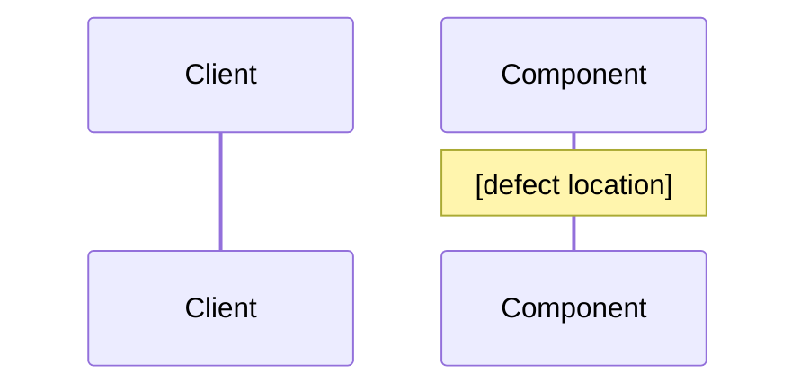

<!--
  Design Document Template (SDD Bugfix Pipeline)

  Produced by: sdd:spec-generator bugfix mode (after bugfix.md is approved)
  Consumed by: subagent-driven-development

  Bugfix designs are smaller and more focused than feature designs.
  Root cause analysis comes first, fix approach second.

  Replace all [bracketed] placeholders with actual content.
  Remove these HTML comments when creating a real spec.
-->

# Bugfix Design: [Bug Title]

## Root Cause Analysis

<!--
  The most important section. What is actually causing the bug?
  Include:
  - The code path that produces the incorrect behaviour
  - Why it produces the incorrect behaviour (the underlying defect)
  - File paths and line numbers where the defect lives
  - Why existing tests didn't catch this
-->

[Detailed explanation of the root cause. Include file paths, line numbers, and the specific code that produces the defect.]

### Code Path

<!--
  Trace the request/call flow that exhibits the bug.
  Use a sequence diagram if multi-component, or a bullet list if single-component.
-->

### Why Existing Tests Missed It

<!--
  Be honest. Common reasons:
  - The scenario wasn't covered
  - A mock hid the real behaviour
  - The test asserted the wrong property
  This drives the test additions in tasks.md.
-->

[Explanation of the test coverage gap.]

## Fix Approach

<!--
  Describe the fix at a level a developer can implement.
  Include:
  - What code changes
  - What stays the same
  - Why this approach over alternatives
-->

[Description of the fix and the rationale for choosing it.]

### Changes Required

| File | Change | Reason |
|------|--------|--------|
| [path] | [change description] | [why] |

### Alternatives Considered

<!--
  Briefly document rejected approaches and why.
  Prevents future re-litigation of the decision.
-->

- **[Alternative 1]** — Rejected because [reason]
- **[Alternative 2]** — Rejected because [reason]

## Correctness Properties

<!--
  Two properties every bugfix design should validate.
  These map directly to bugfix.md sections.
-->

### Property 1: Fault Condition

_For any_ [reproduction condition from bugfix.md], the current implementation SHALL produce [incorrect behaviour], and the fixed implementation SHALL produce [correct behaviour].
**Validates: Current Behaviour 1, 2; Expected Behaviour 1, 2**

This property is tested BEFORE the fix to confirm the bug reproduces, and AFTER the fix to confirm it no longer does.

### Property 2: Preservation

_For any_ [scenario outside the fault condition], the system SHALL continue to behave as before.
**Validates: Unchanged Behaviour 1, 2, 3**

## Regression Test Strategy

<!--
  For each Unchanged Behaviour entry, document the test that locks it down.
  These tests should be written BEFORE the fix where possible — they
  prove the unchanged behaviour holds before, during, and after the fix.
-->

| Unchanged Behaviour | Test Layer | Test Location |
|---|---|---|
| [behaviour] | Unit / Integration / E2E | [file path] |
| [behaviour] | Unit / Integration / E2E | [file path] |

## Error Handling Changes

<!--
  Only include if the fix changes error responses, status codes,
  or error messages. Otherwise omit.
-->

[Describe any changes to error handling, or "No error handling changes."]
