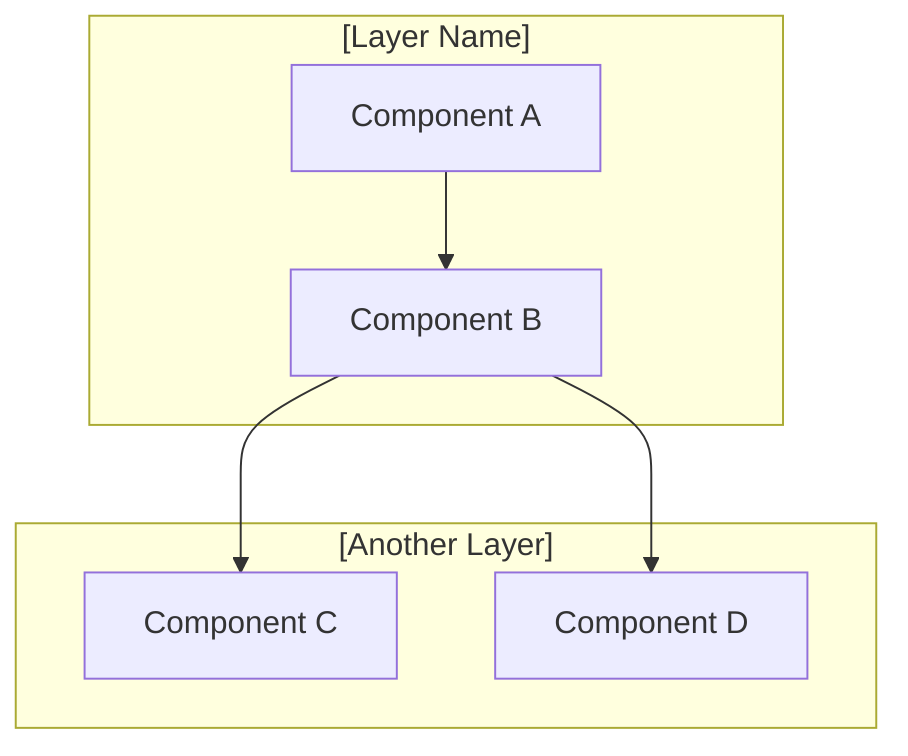
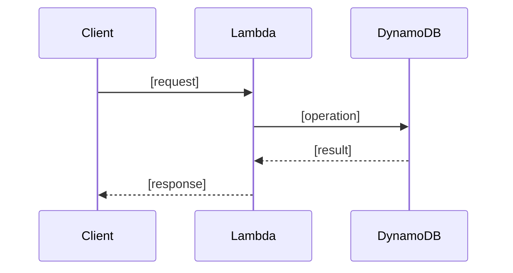
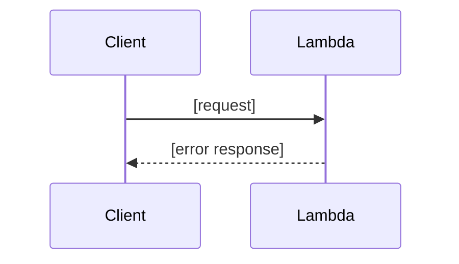

<!--
  Design Document Template (SDD Feature Pipeline)

  Produced by: sdd:spec-generator Phase 2
  Consumed by: sdd:spec-design-review, sdd:spec-generator Phase 3 (tasks),
               sdd:spec-implementation-audit

  Replace all [bracketed] placeholders with actual content.
  Remove these HTML comments when creating a real spec.

  Required sections: Overview, Key Design Decisions, Architecture,
  Components and Interfaces, Data Models, Correctness Properties,
  Error Handling, Testing Strategy.

  Conditional sections (include when applicable):
  - API Specifications: when the feature involves new or modified endpoints
  - Sequence Diagrams: when multi-component interactions exist
  - Cloud Service Integration: when using managed cloud services
  - Security Architecture: when handling auth, user data, or external input
  - Performance Considerations: when latency or throughput is a concern
-->

# Design Document: [Feature Name]

Examples in this template use one stack (Kotlin backend, TypeScript frontend, AWS infrastructure). Substitute your own.

## Overview

<!--
  Provide a technical overview:
  - What the feature does at a high level
  - Architectural approach and key technology choices
  - How it fits into the existing system
-->

[Technical overview of the feature, architectural approach, and how it integrates with the existing system.]

## Key Design Decisions

<!--
  Document major technical decisions with rationale.
  Format: Decision -> Rationale -> Trade-offs
  Include alternatives considered and why they were rejected.
-->

1. **[Decision]**: [Rationale and trade-offs]
2. **[Decision]**: [Rationale and trade-offs]

## Architecture

<!--
  Include a Mermaid diagram showing system architecture.
  Show components, their relationships, and data flow.
-->



## Components and Interfaces

<!--
  For each component, describe:
  - Responsibility
  - Interface definition (in the project's language: Kotlin or TypeScript)
  - Key behaviors
-->

### 1. [Component Name]

**[ComponentName]**
- [Responsibility description]
- [Key behavior description]

```kotlin
[Interface definition in project language]
```

### 2. [Component Name]

**[ComponentName]**
- [Responsibility description]

```typescript
[Interface definition in project language]
```

## Data Models

<!--
  Define data structures used by the feature.
  Include all fields with types and constraints.
  Cover database schemas (DynamoDB tables, indexes, keys) and DTOs.
  Provide concrete examples of data (e.g., actual DynamoDB item structure).
-->

```kotlin
[Data model definitions with all fields and types]
```

### Database Schema

<!--
  DynamoDB table definitions, partition/sort keys, GSIs, TTL settings.
  Include concrete examples of items stored.
-->

| Attribute    | Type   | Description          |
| ------------ | ------ | -------------------- |
| [field]      | [type] | [description]        |

## API Specifications

<!--
  INCLUDE THIS SECTION when the feature involves new or modified endpoints.
  Align with existing patterns in openapi.yaml.

  For each endpoint, specify:
  - Method, path, headers
  - Request/response schemas with all fields
  - Error codes and descriptions
  - Authentication requirements (IAM/SigV4, guest vs registered)
-->

### [METHOD] [/api/v1/endpoint]

**Authentication:** [IAM SigV4 / None]

**Request:**
```json
{
  "[field]": "[type] - [description]"
}
```

**Response (200):**
```json
{
  "[field]": "[type] - [description]"
}
```

**Error Responses:**

| Status | Code              | Description             |
| ------ | ----------------- | ----------------------- |
| 400    | [ERROR_CODE]      | [description]           |
| 404    | [ERROR_CODE]      | [description]           |

## Sequence Diagrams

<!--
  INCLUDE THIS SECTION when the feature has multi-component interactions.
  Cover happy path and error handling scenarios.
-->

### Happy Path



### Error Scenario



## Cloud Service Integration

<!--
  INCLUDE THIS SECTION when the feature uses AWS services.
  Cover Lambda, DynamoDB, S3, Bedrock, Cognito, etc.
  Include IAM policies, CloudFormation resource definitions.
-->

### [Service Name] Configuration

```yaml
[CloudFormation or configuration YAML]
```

### IAM Policy

```json
{
  "Effect": "Allow",
  "Action": ["[service:action]"],
  "Resource": "[resource ARN]"
}
```

## Security Architecture

<!--
  INCLUDE THIS SECTION when the feature handles auth, user data, or external input.
  Cover authentication/authorization flows, input validation,
  data encryption (in transit/at rest), and data privacy.
-->

- **Authentication**: [How users are authenticated for this feature]
- **Authorization**: [What permissions are required]
- **Input Validation**: [Validation strategy for user input]
- **Data Protection**: [Encryption, retention, privacy considerations]

## Correctness Properties

<!--
  Properties are universal statements about system behavior.
  Each property validates specific requirements.

  Format:
  ### Property N: [Property Title]
  _For any_ [input/condition], [system behavior] SHALL [expected outcome]
  **Validates: Requirements N.N, N.N**

  Properties are checked by sdd:spec-design-review for traceability.
  They may inform unit/integration tests but property-based testing
  is optional — the QA matrix in spec-qa-review is the test gate.
-->

### Property 1: [Property Title]

_For any_ [valid input], [the system] SHALL [expected behavior].
**Validates: Requirements N.N**

### Property 2: [Property Title]

_For any_ [condition], [the system] SHALL [expected behavior].
**Validates: Requirements N.N, N.N**

## Error Handling

<!--
  Describe error handling strategy:
  - Error classification and HTTP status codes
  - Error response format
  - Retry and fallback strategies
  - Graceful degradation
-->

### Error Classification

| Category       | HTTP Status | Error Code       | Description          | Retry? |
| -------------- | ----------- | ---------------- | -------------------- | ------ |
| [category]     | [status]    | [code]           | [description]        | [Y/N]  |

### Error Response Format

```json
{
  "error": "[ERROR_CODE]",
  "message": "[Human-readable message]"
}
```

## Performance Considerations

<!--
  INCLUDE THIS SECTION when the feature has latency or throughput concerns.
  Cover performance targets, caching, concurrency, and DB optimization.
-->

- **Latency targets**: [p50, p95, p99 if applicable]
- **Caching**: [What is cached, TTL, invalidation strategy]
- **Concurrency**: [Concurrent processing patterns]
- **DB optimization**: [Indexes, query patterns, capacity]

## Testing Strategy

<!--
  Describe testing approach at each layer.
  Include specific test scenarios, not just categories.

  This section informs sdd:spec-qa-review plan mode — be specific
  enough that the 5-layer coverage matrix can be filled.
-->

### Unit Tests

- [Specific test scenario for component/service]
- [Specific test scenario for edge case]

### Integration Tests

- [Cross-component test scenario]
- [API handler + service + repository test scenario]

### E2E Tests

- [User-facing flow test scenario in e2e/ directory]

### Performance Tests

- [Load assumption / latency budget being validated, if applicable]

### Security Tests

- [Auth boundary / input validation / OWASP scenario being validated, if applicable]
