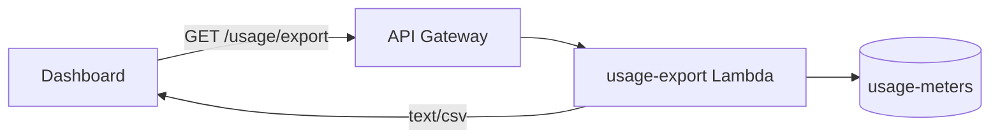

# Design Document: Usage Export

## Overview

A new `GET /accounts/{accountId}/usage/export` endpoint returns the current Billing_Period's usage as `text/csv`. The Dashboard gains a download button on the usage page that calls the endpoint and saves the response. The export is built from the `usage-meters` table, which already holds everything the usage page shows, so no new storage is needed.

## Key Design Decisions

- **Synchronous response.** Exports are small (one Account, one month) and a streaming response keeps the Lambda under the 6 MB payload limit for every Plan we offer. An async job with S3 pre-signed URLs was rejected as heavier than the problem.
- **Read from `usage-meters`.** The table is already read by the usage endpoint and is the source of truth for the Dashboard, so the export cannot disagree with what the Account_Owner sees on screen.
- **Spring-style controller.** A dedicated `UsageExportController` annotated with `@RestController` keeps the CSV concerns out of the existing usage handler.

## Architecture



## Components and Interfaces

```kotlin
@RestController
class UsageExportController(private val exports: UsageExportService) {
    @GetMapping("/accounts/{accountId}/usage/export", produces = ["text/csv"])
    fun export(@PathVariable accountId: String): ResponseEntity<String> =
        ResponseEntity.ok(exports.csvFor(accountId))
}

class UsageExportService(private val meters: UsageMeterRepository, private val clock: Clock) {
    fun csvFor(accountId: String): String {
        val period = YearMonth.now(clock).toString()
        val meter = meters.find(accountId, period) ?: return HEADER
        return HEADER + "\n" + "${meter.accountId},${period},${meter.metered}"
    }
    companion object { const val HEADER = "account_id,billing_period,metered" }
}
```

## Data Models

No new tables. Reads the existing `usage-meters` item for the Account and the current Billing_Period:

| Attribute | Type | Notes |
|---|---|---|
| `accountId` | S | Partition key |
| `billingPeriod` | S | Sort key, `YYYY-MM` |
| `metered` | N | Running count of Metered_Events |

## Correctness Properties

- _For any_ Account, the export for the current Billing_Period SHALL report the same `metered` count as `GET /accounts/{accountId}/usage`. **Validates: Requirements 3.1**
- _For any_ Account with no `usage-meters` item for the period, the export SHALL contain the header row only. **Validates: Requirements 3.3**

## Error Handling

| Condition | Status | `Problem.code` |
|---|---|---|
| Unknown account | 404 | `account-not-found` |
| Suspended account | 403 | `account-suspended` |

## API Specifications

`GET /accounts/{accountId}/usage/export`

- Parameters: `accountId` (path)
- Response 200: `text/csv`
- Response 404: `Problem`
- Response 403: `Problem`

## Testing Strategy

- Unit tests for `UsageExportService.csvFor` covering a present and an absent meter item.
- Integration test: controller to repository against DynamoDB Local.
- E2E: Dashboard download button produces a file with the expected header.
